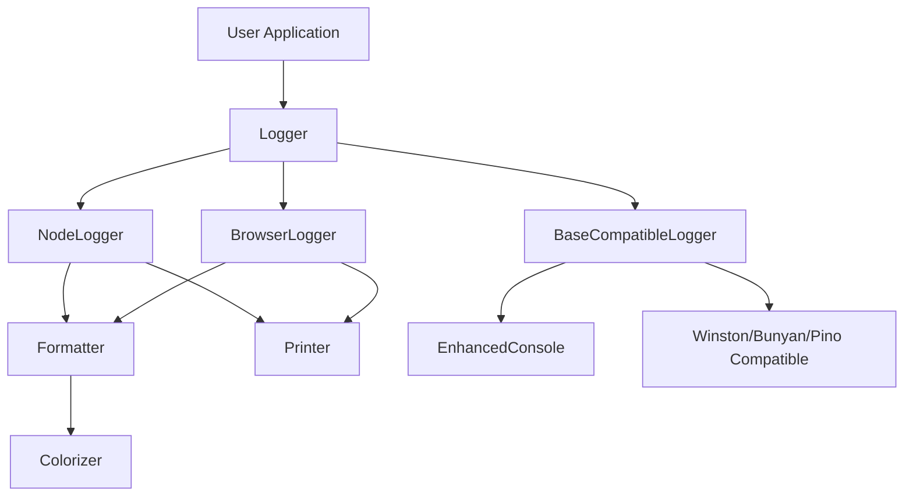

# Magiclogger

<!-- VERSION_BADGE_PLACEHOLDER -->

<!-- /VERSION_BADGE_PLACEHOLDER -->

A powerful, no-config cross-platform logging library for both Node.js and browsers with rich styling, colors, and multiple output formats. Provides drop-in compatibility with popular logging libraries.

<p align="center">
  <a href="https://manic.agency" target="_blank">
    
  </a>
</p>

## Table of Contents

- [Features](#features)
- [Installation](#installation)
- [Module Formats](#module-formats)
- [Build Output Sizes](#-build-output-sizes)
- [Test Coverage](#-test-coverage)
- [Quick Start](#quick-start)
- [Drop-in Compatibility](#drop-in-compatibility)
- [Usage](#usage)
  - [Logging Methods](#logging-methods)
  - [Visual Elements](#visual-elements)
  - [Custom Styling](#custom-styling)
  - [File Logging](#file-logging)
  - [Browser Storage](#browser-storage)
- [Cross-Environment Support](#cross-environment-support)
- [Advanced Configuration](#advanced-configuration)
- [Available Styles](#available-styles)
  - [Colors](#colors)
  - [Style Presets](#style-presets)
- [Themes](#themes)
- [Architecture](#architecture)
  - [Core Components](#core-components)
  - [Data Flow](#data-flow)
  - [Key Responsibilities](#key-responsibilities)
- [Extending MagicLogger](#extending-magiclogger)
- [Documentation](#documentation)
- [License](#license)

## Features

- 🎨 **Rich Styling** - Colors, bold, italic, underline in both terminal and browser console
- 🔄 **Universal Log Method** - Single method with flexible level support
- 📊 **Progress Bars & Tables** - Visualize data and progress directly in your terminal or browser
- 📝 **Output Persistence** - File logging in Node.js and localStorage in browsers
- 🔌 **Extensive Compatibility** - Drop-in replacement for console, Winston, Bunyan, Pino, and custom loggers
- 🔗 **Link Preservation** - Automatically detects and preserves formatting of URLs and file paths
- 🧩 **Custom Styling** - Apply colors and styles to specific parts of messages
- ⚡ **Zero Config** - Works out of the box with sensible defaults
- 📦 **Zero Dependencies** - No external packages required
- 🌐 **Environment Awareness** - Auto-detects Node.js or browser environment
- 🧵 **Multiple Module Formats** - ESM, CommonJS, and TypeScript declarations

## Installation

```bash
npm install magiclogger
# or
yarn add magiclogger
```

## Module Formats

MagicLogger provides both ESM and CommonJS module formats to support all JavaScript environments:

```javascript
// ESM (Modern JS)
import { Logger } from 'magiclogger';

// CommonJS (Legacy)
const { Logger } = require('magiclogger');

// TypeScript
import { Logger, ColorName, LogLevel } from 'magiclogger';
```

<!-- BUILD_OUTPUT_SIZES_PLACEHOLDER -->
## 📦 Build Output Sizes
| File | Format | Size |
|------|--------|------|
| index.js | CJS | 45.62 KB |
| index.mjs | ESM | 335 B |
| index.d.ts | Types | 24.12 KB |

*Generated via `scripts/analyze-build.js`.*
<!-- /BUILD_OUTPUT_SIZES_PLACEHOLDER -->

<!-- TEST_COVERAGE_PLACEHOLDER -->
## 📊 Test Coverage


### Coverage Breakdown
- **Statements**: 85.00% covered
- **Branches**: 80.00% covered
- **Functions**: 90.00% covered
- **Lines**: 85.00% covered

Detailed coverage report available in [test-coverage.md](./docs/test-coverage.md)
<!-- /TEST_COVERAGE_PLACEHOLDER -->

## Quick Start

Try the demos:

```sh
# Console demo
npm run demo
# Console demo with API call examples
npm run demo:guided
# Web demo
npm run demo:web
```

```javascript
import { Logger } from 'magiclogger';

// Create a new logger instance
const logger = new Logger({
  verbose: true,     // Show debug messages (default: false)
  writeToDisk: true, // Write logs to file in Node.js (default: false)
  storeInBrowser: true, // Store logs in browser localStorage (default: false)
  logDir: './logs',  // Directory for log files (default: './logs')
});

// Universal log method with different levels
logger.log('This is a standard info message');
logger.log('Warning: something might be wrong', 'warn');
logger.log('Critical error encountered', 'error');
logger.log('Detailed debug information', 'debug');
logger.log('Operation completed successfully', 'success');

// Or use direct level-specific methods
logger.info('Application starting up...');
logger.warn('Connection pool nearing capacity');
logger.error('Database connection failed');
logger.debug('User authentication details');
logger.success('Email sent successfully');
```

## Drop-in Compatibility

MagicLogger provides seamless compatibility with popular logging libraries, allowing you to enhance your existing logging code without major refactoring:

### Console Enhancement

```javascript
import { enhanceConsole } from 'magiclogger';

// Enhance the console object with all MagicLogger capabilities
const { logger, restoreConsole } = enhanceConsole({ writeToDisk: true });

// Use standard console methods with enhanced styling
console.log('Standard log message');
console.warn('Warning message');

// Access new methods
console.header('SYSTEM STATUS');
console.success('Database connected');
console.progress(75);  // 75% progress bar
```

### Winston / Bunyan / Pino Compatible

```javascript
// Winston-compatible interface
import { createWinstonCompatible } from 'magiclogger';
const winstonLogger = createWinstonCompatible({ verbose: true });
winstonLogger.info('Server started');

// Bunyan-compatible interface
import { createBunyanCompatible } from 'magiclogger';
const bunyanLogger = createBunyanCompatible({ name: 'my-app' });
bunyanLogger.info({ userID: 123 }, 'User logged in');

// Pino-compatible interface
import { createPinoCompatible } from 'magiclogger';
const pinoLogger = createPinoCompatible();
pinoLogger.info('Request received');
```

For detailed information on compatibility options, see our [Compatibility Guide](./docs/compatibility.md).

## Usage

### Logging Methods

```javascript
// Universal log method with different levels
logger.log('Processing user data');                    // Default: info level
logger.log('High CPU usage detected', 'warn');         // Warning level
logger.log('Database connection failed', 'error');     // Error level

// Direct level methods
logger.info('Application started');
logger.warn('Cache expiring soon');
logger.error('Failed to authenticate user');
logger.debug('Auth token details');
logger.success('Email sent successfully');
```

### Visual Elements

```javascript
// Section headers
logger.header('APPLICATION INITIALIZATION');

// Progress bars
logger.progressBar(50);  // 50% complete
logger.progressBar(75, 30, '▓', '░');  // Custom appearance

// Tables
logger.table([
  { id: 1, name: 'Alice', role: 'Admin' },
  { id: 2, name: 'Bob', role: 'User' },
]);
```

### Custom Styling

```javascript
// Style entire messages
logger.custom('Database migration starting...', ['blue', 'bold'], 'DB');

// Use predefined style presets
logger.styled('Critical system notification', 'important');

// Colorize specific parts
logger.colorParts('File uploaded: user.json (2.4MB)', {
  'user.json': ['cyan', 'underline'],
  '2.4MB': ['green', 'bold']
});
```

### File Logging

In Node.js environments, MagicLogger can write logs to disk:

```javascript
const logger = new Logger({
  writeToDisk: true,
  logDir: './app-logs',
  logRetentionDays: 14  // Keep logs for 14 days (default: 30)
});

// Get the path to the current log file
const logPath = logger.getPath();
```

### Browser Storage

In browser environments, MagicLogger can store logs in localStorage:

```javascript
const logger = new Logger({
  storeInBrowser: true,            // Enable browser storage
  maxStoredLogs: 1000,             // Store up to 1000 log entries
  storageName: 'my-app-logs',      // Custom storage key name
  useLocalStorage: true            // Use localStorage vs future alternatives
});

// Retrieve logs from browser storage
const logs = logger.getLogs();

// Download logs as a text file
logger.downloadLogs('application-logs.txt');

// Clear all stored logs
logger.clearLogs();
```

For detailed information on browser storage features, see our [Browser Storage Guide](./docs/browser-storage.md).

## Cross-Environment Support

MagicLogger automatically adapts to its environment:

```javascript
// The same logger works seamlessly in both environments
const logger = new Logger({
  writeToDisk: true,     // Used in Node.js, ignored in browser
  storeInBrowser: true,  // Used in browser, ignored in Node.js
  verbose: true          // Works in both environments
});

// Log methods work the same in both environments
logger.info('Application starting');
logger.warn('Resource not found');
logger.error('Operation failed');

// Environment-specific features are available when needed
if (typeof window !== 'undefined') {
  // Browser-specific operations
  const logs = logger.getLogs();
  logger.downloadLogs('app-logs.txt');
} else {
  // Node.js-specific operations
  const logPath = logger.getPath();
}
```

## Advanced Configuration

Change logger settings at runtime:

```javascript
// Change log directory (Node.js)
logger.setLogDir('./new-logs', true);  // true to reinitialize log file

// Enable/disable browser storage
logger.setStorageEnabled(true);

// Enable/disable verbose mode
logger.setVerbose(true);

// Enable/disable colors
logger.setColorsEnabled(true);

// Change log retention period (Node.js)
logger.setLogRetentionDays(14, true);  // true to clean old logs immediately
```

## Available Styles

### Colors

```javascript
// Foreground colors
'black', 'red', 'green', 'yellow', 'blue', 'magenta', 'cyan', 'white', 'gray',

// Bright foreground colors
'brightRed', 'brightGreen', 'brightYellow', 'brightBlue', 
'brightMagenta', 'brightCyan', 'brightWhite',

// Background colors
'bgBlack', 'bgRed', 'bgGreen', 'bgYellow', 'bgBlue', 
'bgMagenta', 'bgCyan', 'bgWhite', 'bgGray',

// Text styles 
'bold', 'dim', 'italic', 'underline', 'blink', 'reverse', 'strikethrough'
```

### Style Presets

Type-safe presets for consistent styling:

- `'debug'` - Gray, italic
- `'info'` - Cyan, bold
- `'warning'` - Yellow, bold
- `'error'` - Bright red, bold
- `'success'` - Green, bold
- `'important'` - Bright yellow, bold
- `'highlight'` - Bright white, bold
- `'muted'` - Dim or gray
- `'special'` - Magenta, bold
- `'code'` - Bright cyan
- `'header'` - Bright white, blue background, bold

## Themes

### 🖌️ Theme Support

MagicLogger supports dynamic theming using named presets or custom-defined themes:

```javascript
// Use a predefined theme
const logger = new Logger({
  theme: 'dark' // Loads the 'dark' theme from themes.json
});

// Apply a custom theme
const customTheme = {
  info: ['cyan', 'bold'],
  error: ['brightRed', 'bold'],
  success: ['green', 'bold'],
  header: ['brightWhite', 'bgBlue', 'bold']
};

logger.setTheme(customTheme);
logger.info('This log uses a custom theme!');

// Update individual styles at runtime
logger.setTheme({ info: ['magenta', 'bold'] });
logger.info('Theme updated at runtime');
```

## Architecture

MagicLogger follows a layered architecture with clear separation of concerns:

### Core Components



### Data Flow

1. **User Call**: Application calls a logging method
2. **Logger**: Determines environment and delegates to appropriate implementation
3. **Implementation**: NodeLogger or BrowserLogger processes the log message
4. **Formatting**: Formatter uses Colorizer to apply styles to the message
5. **Output**: Printer handles the final output based on environment

### Key Responsibilities

#### Colorizer
- Provides color and styling utilities
- Handles ANSI color codes for terminal 
- Supports standard, bright, and background colors
- Applies text styles (bold, italic, underline)
- Core utility with no dependencies on other components

#### Formatter
- Applies formatting using Colorizer
- Detects and preserves links and file paths
- Supports style presets for consistent formatting
- Manages color enabling/disabling

#### Printer
- Abstracts output between Node.js and browsers
- Handles progress bars and special formatting
- Manages console output and file/storage writing
- Adapts to terminal capabilities

#### Logger
- Presents unified API to users
- Auto-detects environment (Node.js vs browser)
- Supports multiple log levels
- Provides convenience methods

#### Compatibility Layer
- Offers drop-in replacements for popular logging libraries
- Maintains consistent styling across different interfaces
- Adapts third-party logger APIs to MagicLogger's core
- Extends the base functionality without modifying core components

## Extending MagicLogger

You can write your own loggers using MagicLogger:

```javascript
import { BaseCompatibleLogger } from 'magiclogger';

class MyNewLogger extends BaseCompatibleLogger {
  log(level: string, message: string): void {
    switch (level) {
      case 'info':
      case 'warn':
      case 'error':
      case 'debug':
      case 'success':
        this.logger.log(message, level as LogLevel);
        break;
      case 'trace':
        this.logger.debug(`TRACE: ${message}`);
        break;
      case 'fatal':
        this.logger.error(`FATAL: ${message}`);
        break;
      default:
        if (this.strictLevels) {
          throw new Error(`Unknown level: ${level}`);
        }
        this.logger.custom(message, ['white'], level.toUpperCase());
    }
  }
}
```

## Documentation

📚 **[Full Documentation Website](https://manicinc.github.io/magiclogger/)**

### Core Documentation
- [API Reference](./docs/api_usage.md) - Complete API documentation and examples
- [Browser Storage Guide](./docs/browser_storage.md) - Client-side logging and storage
- [Compatibility Guide](./docs/compatibility.md) - Drop-in replacements for Winston, Bunyan, Pino
- [Terminal Support](./docs/terminal_support.md) - Advanced terminal capabilities and ANSI support

### Features & Styling
- [Styling Guide](./docs/styling.md) - Colors, gradients, and visual formatting
- [Test Coverage](./docs/test_coverage.md) - Comprehensive testing information
- [Code Coverage](./docs/codecov.md) - Coverage reporting and metrics

### Development
- [Contributing Guide](./docs/contributing.md) - How to contribute to the project
- [Developer's Guide](./docs/development.md) - Development setup and workflow
- [Build Instructions](./docs/build_instructions.md) - Building and packaging
- [Git Workflow](./docs/git_workflow.md) - Version control and branching
- [Publishing Guide](./docs/publishing.md) - Release and deployment process
- [CI/CD Setup](./docs/cicd.md) - Continuous integration and deployment

## License

MIT

---

Created by [Manic.agency](https://manic.agency) - Mania driven development 🎨
Contact: [team@manic.agency](mailto:team@manic.agency) | GitHub: [@manicinc](https://github.com/manicinc)